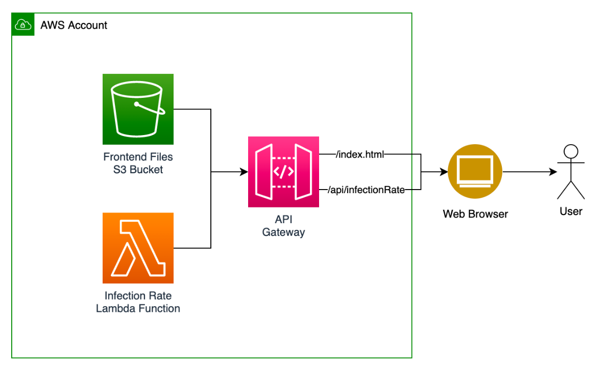

# alleXminuten-aws-serverless

This project builds upon [alleXminuten](https://github.com/finreinhard/alleXminuten) and implements an API and hosting stack for the site using AWS serverless technologies.

This application is primarily intended for demonstration and training purposes. There is an accompanying talk to this project.

The slides of the talk (German) are available:  [slides/Serverless in der AWS.pdf](slides/Serverless%20in%20der%20AWS.pdf)

AWS technologies used:

* AWS Cloud Development Kit
* AWS CloudFormation
* AWS Lambda
* Amazon API Gateway
* Amazon S3

See [README_CDK.md](./README_CDK.md) for instructions on how to deploy the CDK project on your own AWS account.

See [README_alleXminuten.md](./README_alleXminuten.md) for the readme of the [alleXminuten](https://github.com/finreinhard/alleXminuten) project.